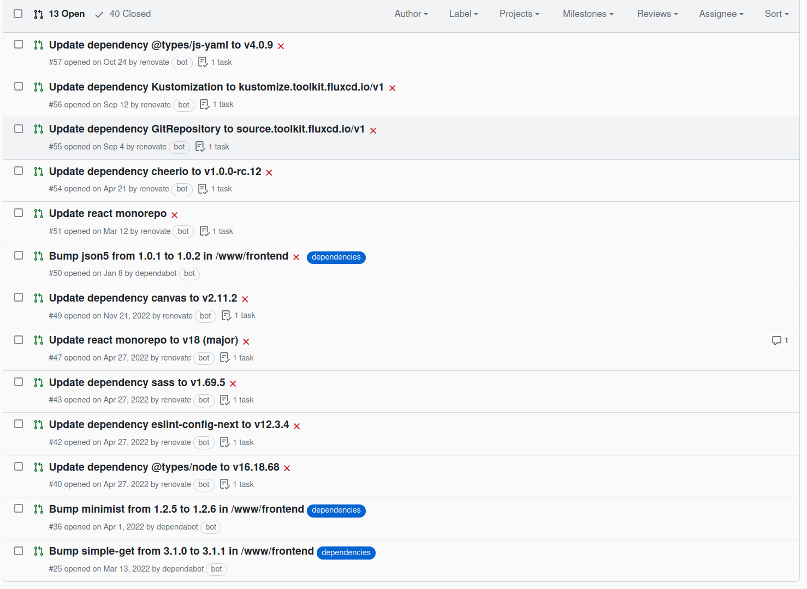
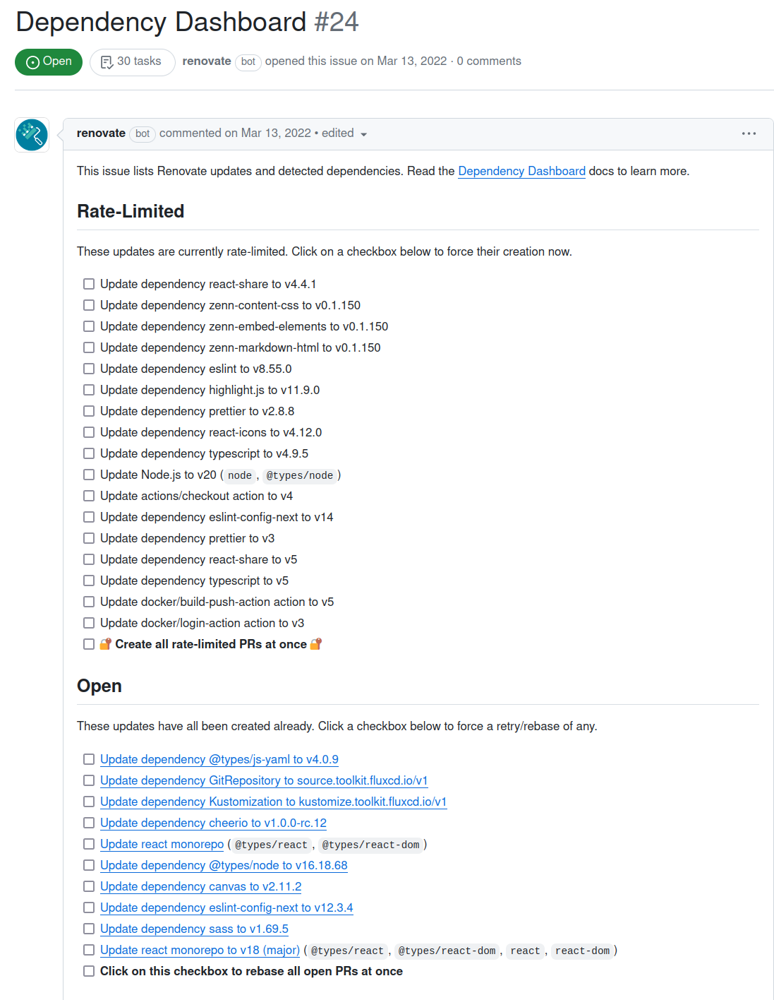
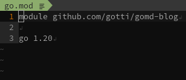
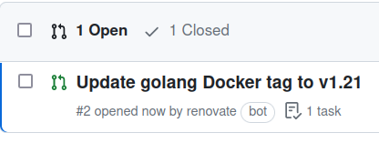

## はじめに

この記事は、[UEC Advent Calendar 2023](https://adventar.org/calendars/8698)の14日目の記事です。
前の記事は、もっちゃんの[モチ娘、サークルをUEC大学公認まで育成ダービーの話。 ](https://mocchan.dev/daily-life/uec-advent-calendar-2023/)です。[なんかこの前も見てない？](https://adventar.org/calendars/8696)

## 以前のブログ

以前のブログはNext.jsで作っていました。Reactベースのフレームワークで便利だったのですが、ブログはほとんど更新しないのに依存パッケージの更新をするのが面倒になっていまいました。

そこで名案が浮かびます。一つも外部パッケージを利用しないブログを作れば、パッケージの更新をしなくても良いのでは……？

## Golang

私はGoをよく書いています。Goには、以下のような機能が標準ライブラリに含まれています。

- HTMLテンプレートエンジン `html/template`
- HTTPサーバー `net/http`
- JSONエンコーダ/デコーダ `encoding/json`

頑張れば、ブログを作れそうな気がしてきます。

## 方針

- ブログの中身はMarkdown
- pages以下のmdを適当にルーティング
- HTMLテンプレートをコンポーネントぽく使う
- テンプレート側でも他のテンプレートを読み込めるが、Go側で埋め込むことに。
- 設定ファイルはjson
    - yamlもtomlも標準ライブラリには無いが、なぜかjsonはあるので。

## 実装

ひたすらMarkdownのパーサを書きます。ネストできてしまうlistがツラい。。。
今回はSSGのみとして、Markdownのパースは初回だけ行い、メモリに積んでおきました。

## ディレクトリ構成

- app/app.go: HTTPサーバ
- pkg/mdparser/: MarkdownをパースしHTMLに変換
- pkg/framework/: HTMLテンプレートを使ってサイト構造を決定
- pages/: ページごとのMarkdownファイル

## 結果

go.mod(jsでいうpackage.json)は以下のようになりました。普通のプロジェクトならバージョンの下に依存パッケージが続いていますが、依存パッケージは空です。Go言語のアップデートにだけ追従すれば良いです。

PRは、こうなりました。

## おわりに

自作Markdownパーサのお手入れの方が苦しいかもしれん。。。
