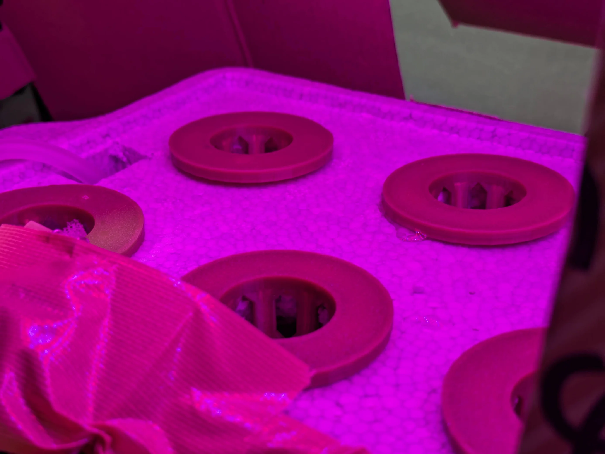
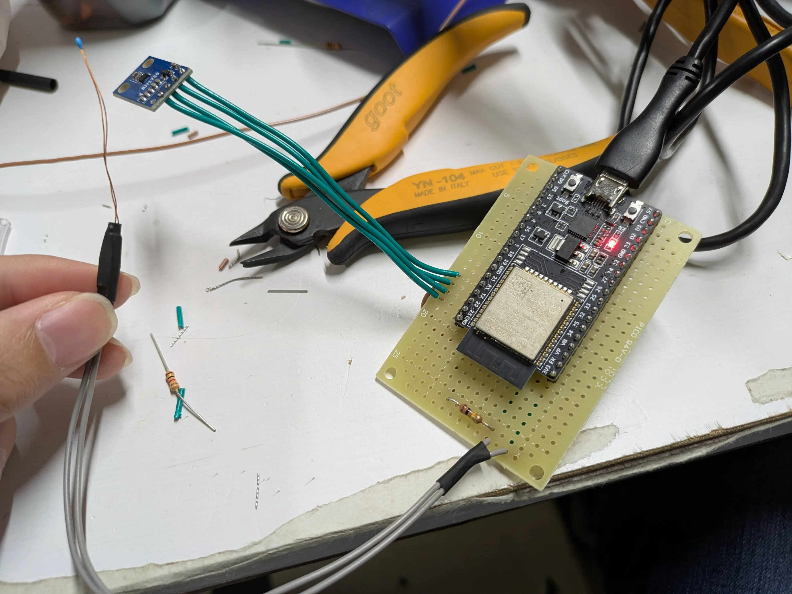

## はじめに

食費を浮かせるために水耕栽培を始めた。
部屋がサーバーの排熱で暖かいため、スイートバジル・サニーレタスを栽培している。
どちらも春に春に種をまくらしいが、排熱で部屋を温室にして無理やり育てている。

## 機材

### ライト

アリエクで買ったLEDテープ
赤と青のLEDが3:1の割合で配置されている。
[なかがわ電機サービス](https://lnln.dev/)からタイマーを貰ったので朝から夜まで点灯している。

### タンク

最初は2Lペットボトルを横に倒して使っていたが、なかがわ電機サービスから百均の発泡スチロール箱を貰ったので使っている

### ブクブク

ホームセンターで買った。
エアストーンの音が反響してうるさいので困っている。

### センサー

ESP32にサーミスタと照度計を繋いでいる。
リポジトリ: [https://github.com/gotti/esp32-thermistor-exporter](https://github.com/gotti/esp32-thermistor-exporter)

以前買ったXiaomiの温湿度計Mijiaを一台温室に設置した。
Mijiaは簡単にファームウェアを書き換えてBLEで温湿度を広報するようにでき、ESP32でデータを読み出せる。
リポジトリ: [https://github.com/gotti/esp32-misc-exporter](https://github.com/gotti/esp32-misc-exporter)

これらで、温室の温湿度・水温・照度を計測、自宅サーバのPrometheusでデータを収集してGrafanaで可視化している。
Publicにしているので誰でも見ることができる。[https://grafana.gotti.dev/public-dashboards/b2f3dd57cf9b4a9485c0bea537a3f23d](https://grafana.gotti.dev/public-dashboards/b2f3dd57cf9b4a9485c0bea537a3f23d)
