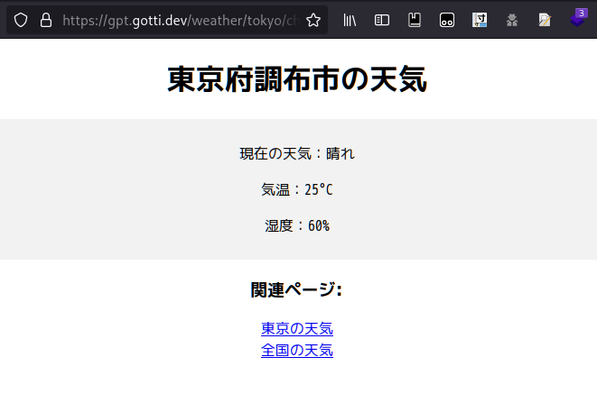
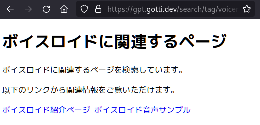

## きっかけ

どうしてか忘れたが，Discordで喋っていたときに，全てのHTTPリクエストに対して，その場でChatGPTで作成したHTMLを返すサイトの話になった．
ちょっと前に流行った全俳句データベースにインスパイアされ，締切が2日後に迫る卒論から逃げたかったので，この世の全ての情報が保存されているウェブサイトとして実装することにした．

## サイト

ここで公開している．[https://gpt.gotti.dev/](https://gpt.gotti.dev/)
飽きたら，もしくはGPT破産したら公開停止する．

GPTに天気を聞くと毎回25度と返される気がする．

全ての情報が載っているので，もちろん検索もできる．

## 実装と公開

[ソースコードはGitHubにある](https://github.com/gotti/random-webserver)．
GPT3.5で，プロンプトが雑なので中身のスカスカなHTMLが生成されてしまう問題がある．
ページの内容とHTMLの構造でプロンプトを二段に分けて生成したりすればマシになるのだろうか．

このページはCloudflare Tunnelで家の鯖から公開している．気が向いたらクラウドに移すかもしれない．
公開から12時間ぐらい経ったがOpenAIのrequestsは2.6k，1M Tokensだった．
料金は1.9ドルで，思ったよりも安くてありがたい．

[https://gpt.gotti.dev/httpリクエストのpathから、chatgptでhtmlを生成するhttpサーバを作りました。この解説をしてください。](https://gpt.gotti.dev/http%E3%83%AA%E3%82%AF%E3%82%A8%E3%82%B9%E3%83%88%E3%81%AEpath%E3%81%8B%E3%82%89%E3%80%81chatgpt%E3%81%A7html%E3%82%92%E7%94%9F%E6%88%90%E3%81%99%E3%82%8Bhttp%E3%82%B5%E3%83%BC%E3%83%90%E3%82%92%E4%BD%9C%E3%82%8A%E3%81%BE%E3%81%97%E3%81%9F%E3%80%82%E3%81%93%E3%81%AE%E8%A7%A3%E8%AA%AC%E3%82%92%E3%81%97%E3%81%A6%E3%81%8F%E3%81%A0%E3%81%95%E3%81%84%E3%80%82)
