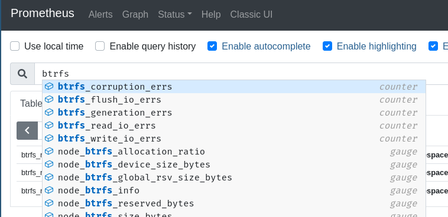

# はじめに

こんにちはuec20のごっちです。猫です。急に記事が書きたくなったので16日の夕方に17日の枠を確保して今この記事を書いています。

これは[UEC 2 Advent Calendar](https://adventar.org/calendars/6598)の17日目の記事です。前の記事は[つまみさんのDisnake + GitHub Actions で作るオタク鯖晒しサイト](https://trpfrog.net/notes/otaku-channels/)です。オタクもうチャンネル作るな。

最近わたしの所属する工学研究部のオタクが自宅サーバに触ったり触ってなかったりするので、一番おうちにあると便利(わたし基準)なファイルサーバの構築方法を書いていきます。

# 準備

## 必要なもの

- パソコン1台
  - Raspberry Piでもいいよ。
- OS用HDD/SSD
  - 小さくてもいいよ
  - Raspberry PiならmicroSDがこれ
- データ用HDD/SSD
  - SATAの方が安心感あるけどRaspberry PiならUSBでもいいんじゃ。
  - できれば同じサイズのを2台以上。
- ある程度コマンド触ったり英語を読んだりできる根気

## ファイルシステム

Linuxではファイルシステムに自分の好みのものを使うことができます。
WindowsだとNTFSやFAT32などをよく見かけますね。そんな感じです。

ファイルシステムにはいろいろ特徴があるので自分に合ったものを選んでいきましょう。4つだけ紹介します。

- ext4
  - Ubuntuとかでたしかデフォルトな有名ファイルシステム。
  - 特に特徴的な機能は(ぼくが知ってる範囲では)無い。
- btrfs
  - 新進気鋭なモダンなファイルシステム。
  - 動的なRAIDレベルの変更や差分バックアップなどをサポート。おすすめ。わたしはこれを使います。
  - SSDキャッシュのサポートは無し。
  - ちょっと読み書きが遅い。
- ZFS
  - メモリやSSDでのキャッシュ(厳密には違うらしい)機能つき。
  - おかねがあって強いパソコン持っててHDD大量に使うならいいかも。わたしは貧乏なので諦めた。
- bcachefs
  - btrfsとZFSを足して2で割ったようなもの。
  - SSDキャッシュをサポート。
  - 開発途上で不安定かも。

この記事ではbtrfsをオススメします。

## HDD/SSD

同じHDD/SSDを複数台用意してRAIDを組むことをオススメします。1つしか使わないとHDDが破損したときに悲しいことになるので。

複数でRAIDを組むと以下のようなことができます。
- HDDが1つ故障してもデータは生きる
- データでbitrotが起きてもHDD1と2でチェックサムが正しい方に修正できる

# ソフト

まあ順当にNFSかsambaあたりでいいんじゃないですか。好みによってnextcloudとかでも。

あと[tailscale](https://tailscale.com/)っていうVPNソフトを入れとくと外から家のファイル鯖にアクセスできます。インストールがめちゃ簡単なのでおすすめです。

なお学内からはプロキシに阻まれて使えません。悲しいね。

# 構築

適当なLinuxディストロをOS用HDDに入れてください。Ubuntu Serverとかが良いんじゃないかな。

起動したらbtrfsをインストールしてください。

ArchWikiに沿ってデータ用HDDにファイルシステムを構築してください。

https://wiki.archlinux.jp/index.php/Btrfs

この際に複数のHDDに同時にファイルシステムを作ることでRAIDを組むことができます。RAID1にしましょう。btrfsのraid1は普通のRAID1と違って同一のデータをn台のデバイスのうち2台に書き込むという設定です。

ちなみにn台のデバイスのうち3,4台に書き込む、より冗長性の高いオプションraid1c3,raid1c4もあります。

RAID1の話に戻ります。btrfsでは例えば6TBのHDDを3台用意しRAID1を組むこともできます。このとき使える容量は18TB/2=9TBとなります。

異なる容量のHDDを組み合せることもできるらしいですがよくわかってないのでggってください。

2台のデバイス`/dev/sdb`と`/dev/sdc`でRAID1を組むときのコマンドはたぶん下みたいな感じです。ちゃんと試してないのでほんとに動くかわかんない。

```
sudo mkfs.btrfs -m raid1 -d raid1 /dev/sdb /dev/sdc
```

あとからデバイスをRAIDに参加させることだってできます。`btrfs device add`するだけでデバイスをプールに追加でき、`btrfs balance`で追加したHDDに対してデータをリバランスすることができます。

あとはsubvolumeを切っておくとバックアップしやすくなります。ArchWiki読んでね。

# 監視

これは好みです。正直おうちでここまでやらなくても。

RAIDを組んでもちゃんと動いているか見ておかないと、気づいたらHDDが1台死んでてもう1個も死んでデータ消失。。となるかもしれません。監視をやりましょう。

ところでみなさんはPrometheusというソフトをご存知ですか？定期的にexporterをスクレイピングしてDBに放りこむソフトです。

node exporterというソフトがパソコンのいろんな情報を拾ってくれます。CPU使用率からディスク使用率などなど。しかしbtrfsのエラー数は拾ってくれないのでそれ用にexporterを書きました。Rustを使っています。

```rust
use actix_web::{get, App, HttpResponse, HttpServer, Responder};
use regex::Regex;
use std::process::Command;
use String;

#[get("/metrics")]
async fn metrics() -> impl Responder {
    let output = Command::new("btrfs")
        .args(["device", "stats", "/mnt"])
        .output()
        .expect("failed to exec btrfs");
    let a = String::from_utf8(output.stdout).unwrap();
    let lines = a.lines().collect::<Vec<&str>>();
    let mut out = String::new();
    for l in lines {
        let re = Regex::new(r"\[(?P<dev>.+)\]\.(?P<err>.+)(?P<n>\d+)").unwrap();
        let b = re.captures(l).unwrap();
        let err_name = b.name("err").unwrap().as_str().replace(" ", "");
        let device = b.name("dev").unwrap().as_str().replace(" ", "");
        let n = b.name("n").unwrap().as_str().replace(" ", "");
        let metrics_name = format!("btrfs_{}", err_name);
        out += &format!("# TYPE {} counter\n", metrics_name);
        out += &format!("{}{{device=\"{}\"}} {}\n", metrics_name, device, n);
    }
    HttpResponse::Ok().body(out)
}

#[actix_web::main]
async fn main() -> std::io::Result<()> {
    HttpServer::new(|| App::new().service(metrics))
        .bind("0.0.0.0:9101")?
        .run()
        .await
}
```

これでエラー数の変化をPrometheusで取得できます。Prometheusにはアラートを飛ばす機能もあるのでエラー数が0より大きくなったときにアラート飛ばすといいかもしれませんね。




# まとめ

- btrfsはあとから構成の変更がやりやすいしRAIDが楽でいいぞ。
- 正直NAS買ったらこれ全部やってくれてつよいSSDキャッシュも使えるので楽。。。
- できればちゃんと監視しようね。
