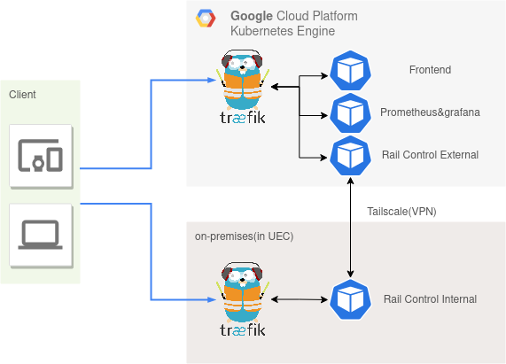
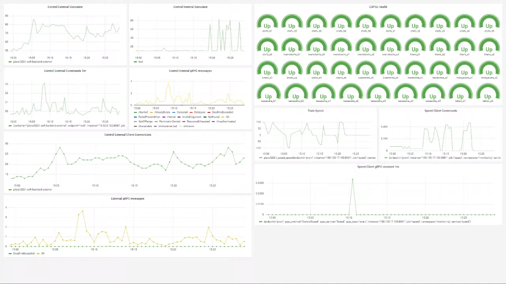

# 調布祭プラレールって？

また今年もプラレールです。去年もやりましたね。去年の記事は[ここを見てください。](https://gotti.dev/post/kokenadvent2020/)

操作ページは以下にあります。調布祭期間中はGKEで操作ページを公開していたのですが現在はvercelにてアーカイブしています。バックエンドサーバは死んでいるので何も操作できませんが雰囲気はわかるかなと思います。

https://chofufes2021.gotti.dev

こんな感じでスマホの操作でプラレールのストップレールや分岐レールを操作することができます。
操作のレスポンスはほとんど即時(測ってない)、WebRTCの配信は4G回線で受けても100ms程度の遅延でした。

<blockquote class="twitter-tweet">
<a href="https://t.co/ajLFQVR348">pic.twitter.com/ajLFQVR348</a>
&mdash; ごっち (@0xg0tti) <a href="https://twitter.com/0xg0tti/status/1462603819247091713?ref_src=twsrc%5Etfw">November 22, 2021</a></blockquote>  

わたしの担当はインフラとバックエンドでした。バックエンドの話はたぶんadvent calendarでやるのでここではインフラの話をやります。

去年は暖かみのある手動デプロイでサーバを更新していました。サーバ上でvimを開いて開発していたときもありました、懐かしいですね。でももうやめましょう。自動化するべきです。

ということで今回インフラ班になったからにはCI/CD(Continuous Integration/Continuous Delivery)をゴリゴリ使っていくことにしました。まあインフラ班は明確に割り振られたわけではなくわたしが勝手にやってただけなのですが。

また今回は迅速な障害対応のためにPrometheusによるアプリケーションのメトリクス収集とgrafanaによる可視化を行なっています。この理由は建前で、本音はグラフを見てにやにやしたかったからです。

では今年のインフラ構成をご紹介します。 あとGitHubのURLはコレです。

https://github.com/ueckoken/plarail2021-soft

# 概要

Kcmastrpc, CC BY-SA 4.0 <https://creativecommons.org/licenses/by-sa/4.0>, via Wikimedia Commons

図です。ほとんどのサーバはGKE上に展開されていますが、一部のサーバは学内にあります。学内のサーバはESP32などのマイコンを叩くため仕方なく置いてある感じです。いくつかは面倒なので図に描かれていません。

# GKE

サークルのお金でGKEの代金が落ちるらしいので借りちゃいました。わたしの家にはg8s(gotti house k8s)があるので最初はこっちでやっていたのですが、ノードがしょぼいのでgrafanaを開いてprometheusを叩くと負荷で落ちます。悲しいね。ちなみにこのサイトはg8sに乗っています。

oauth2-proxyを一部ページの認証に使っていてgrafanaのダッシュボードやWebRTC配信者用ページなどにはGitHubのOrganizationで認証が掛けてあります。forwardAuthするだけで認証を掛けられたtraefikが便利でした。

CDには[FluxCD](https://fluxcd.io/)を使っています。ArgoCDと違ってGUIは無いのですが、別にArgoCDでもGUIは使わないので問題ありません。(※ArgoCD自身の設定をArgoCDで同期させるとGUIいらなくねになっちゃう。)

FluxCDのImageAutomationを使って新しいDockerイメージがghcr.io(GitHub Container Registry)に追加されたらGitHubのmainブランチにあるdeploymentなどのマニフェストを更新するようにしています。詳しくはCI/CDの項目で。

# 学内サーバ

学内サーバにもtraefikを使っていますがこちらはKubernetesではなくdocker-composeです。単ノードKubernetesを用意するのが面倒だったからですが、docker-composeでCDするのも面倒だったのでおとなしくこっちもKubernetesにするべきでした。Github ActionsでSSHを叩いてCDしています。。。

たぶんバックエンドの記事で詳しく書くんですが、GKEと学内サーバのサーバ間通信はgRPCを使っています。これにはちゃんとクライアント認証の機能まで付いているのですが面倒なので今回はVPNを使っています。図でTailscaleの部分ですね。

内部向けはVPN経由だけでアクセスできるようにして外部向けのポートだけをtraefikで公開していた感じでした。

Tailscaleはオタクが推してたので使ってみました。Kubernetesのサイドカーとして突っ込めて一瞬でVPNを張れたのでかなり良かったです。

# CI/CD

自動化、やりたいですよね。今年の調布祭プラレールではデプロイ作業をほとんど自動化しています。GitHubの画面でポチポチするだけでサーバが更新されます。GKE側のデプロイの順序はFluxCDを使ったいつものやつです。

1. GitHubでmainブランチからdeploymentブランチにmerge
2. deploymentブランチのon_pushでGitHub Actionsを実行しdockerイメージをビルド、ghcrにプッシュ
3. ghcr上のイメージの更新を検知したFluxCDがmainブランチのマニフェストを更新
4. FluxCDがmainブランチの変更を検知してサーバを更新

学内側はdeploymentブランチのon_pushでSSHしてgit pull、docker-compose build, upを叩いています。。

余談ですが調布祭の期間中に急にFluxCDが死んだと思ったらGitHubの仕様変更？でした。びっくりした。 https://github.com/fluxcd/flux2/discussions/2097

# 監視

Prometheusで監視をやっています。各サーバはgo言語で書いているのでPrometheus exporterをシュッっと取り付けられます、よい。gRPCのレスポンスコード？などのメトリクスもInterceptorを挟むだけで動いたとバックエンド班のもう1人のオタクが言っていました。

同時接続数(websocketの接続数)や総操作回数、サーバ間のgRPCの通信、マイコンの死活監視などのメトリクスを取得しています。ダッシュボードはこんな感じ。

1080pで表示したものを720pで取ってしまったので文字が荒れちゃってますね。

# 反省と改善

3日目(最終日)に謎のネットワークトラブルが発生しました。謎の操作の遅延が起きていたらしいです。この原因がよくわからなかったことが反省点ですね。今度はzabbixも使ってルータあたりも監視したいです。

エラーログを収集する方法がkubectlやsternを叩くしかなかったのも改善したいです。GKEならちゃんとcloud loggingを使えるようにしたりとかですかね。datadogもいいかもしれません。

IaaCしていないのは許してください。GKE立ててCloud DNSちょっと弄っただけなのでTerraform書くのが面倒でした。

あとはSecretの管理が雑でした。ちゃんと管理するならGitHubとかに暗号化したものを上げるべきなのでしょう。面倒だったのでわたしの手元にしかないです。ただ今回リポジトリがPublicなので許してください。

# まとめ

プロジェクト自体への反省点はいくつもあります。たとえばコードを書き始めたのは調布祭の1ヶ月前ですし、具体的な目標を定めずに風呂敷を広げすぎたり。いくつかの要素は調布祭の前日になって破壊し、速度制御に至っては3日目に破壊しました。。。

でもインフラに限って言えばまあまあ頑張ったのではないでしょうか。褒めてもらいたい。。。

追記: 弊学の情報基盤センターの方へ、疎通確認してから情報コンセントを貸してくださるとインフラ班が楽できます。お願いします。

<blockquote class="twitter-tweet">
ぼく「なんかリンクアップしないんですけど」 情基「ケーブル切れてたわ^^」 ぼく「なんかIPv4パケット全部闇に飲まれるんだけど」 情基「IPアドレス衝突してたわ^^」
&mdash; 反省ロボ (@_nil_a_) <a href="https://twitter.com/_nil_a_/status/1463339569605414913?ref_src=twsrc%5Etfw">November 24, 2021</a></blockquote>  
