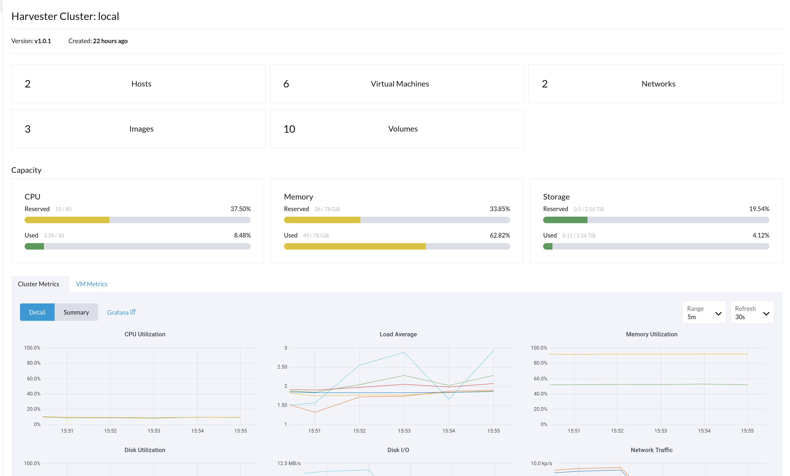
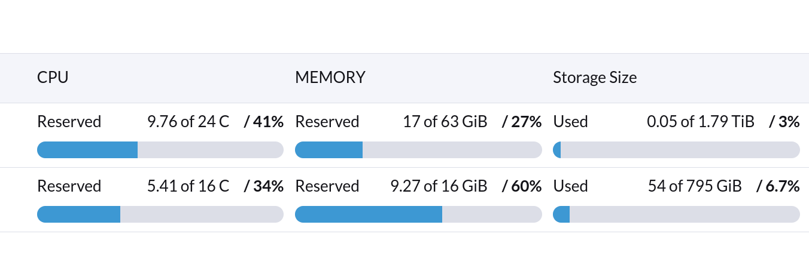
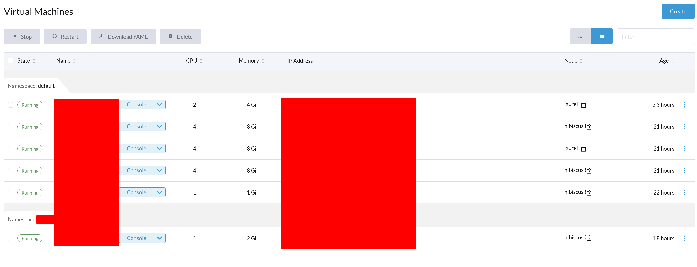
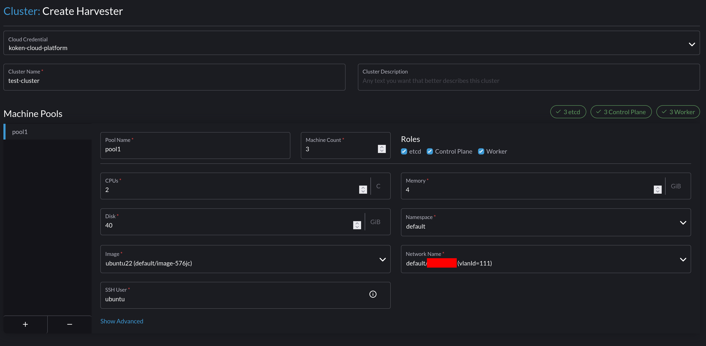
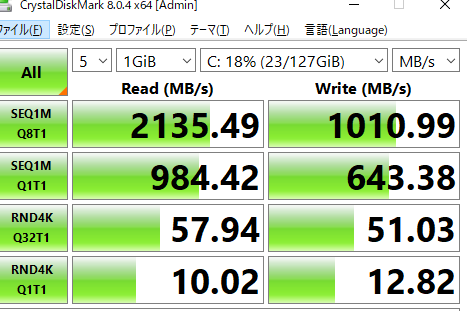

# Harvester HCIでおうちプライベートクラウド

おうちでポンポンVMを生やしたりくばねを生やしたりしたくないですか？私はやりたいです。

SUSEからHarvester HCIというツールが出ているので生やしてみました。サークルを実験台にして。

[https://docs.harvesterhci.io/](https://docs.harvesterhci.io/)

この記事はv1.0.1を導入します。

## できること

- VMを生やす
- 分散ストレージ(LongHorn)
- Rancherと連携
  - VMをノードにしてくばねを生やす。
    - 全自動でやってくれた、すごい。
  - くばねでHarvesterのLongHornからストレージを切り出せる
    - Harvester CSI driver
  - HarvesterのVIPを使ってLoadBalancerを作れる

## 必要なもの

- Rancher Server(パソコン1台以上)
- Harvester HCI(パソコン1台以上)
  - [Requirements](https://docs.harvesterhci.io/v1.0/#hardware-requirements)がデカいです。まあVM動かすのでしょうがないですね。

## Harvesterの使い勝手

Harvester HCIからインストールします。

サークルのX570+5900Xでやってみたところ普通にドキュメントに沿ってインストールできました。ただおうちのX79じゃインストールしても起動しませんでした。なんででしょ。

インストール後のUIはこんな感じでした。







Harvesterは3台にするとHA構成になってくれるらしいので3台にすると良いと思います。LongHornのreplicasもデフォルトは3ですしね。

[Terraform Provider](https://github.com/harvester/terraform-provider-harvester)も提供されています。これだけでもかなり便利に使えそうですね。

## Rancherと連携

本当はちゃんとやるべきなんでしょうが面倒なのでdockerでRancherを動かします。データの永続化だけやっておきましょう。
[ドキュメント通り](https://rancher.com/docs/rancher/v2.6/en/installation/other-installation-methods/single-node-docker/advanced/#persistent-data)にインストールしました。

Harvester HCI自体がRKE2クラスタなのでそこで一緒にRancherも動けばいいのですが、ドキュメントには一切書かれてない感じなのでやるなということかもしれません。

> Run Rancher on a Separate Cluster
> Don’t run other workloads or microservices in the Kubernetes cluster that Rancher is installed on.

[https://rancher.com/docs/rancher/v2.6/en/best-practices/rancher-server/deployment-types/#run-rancher-on-a-separate-cluster](https://rancher.com/docs/rancher/v2.6/en/best-practices/rancher-server/deployment-types/#run-rancher-on-a-separate-cluster)

とのこと。

あとはドキュメントに沿ってカチカチやればRancherとHarvesterを連携できます。Harvester HCIのコンパネでできることは全部Rancherのコンパネからできるようになります。

## クラスタ作成

では早速くばねクラスタを生やしてみます。



これを埋めるだけでHarvester上でVMが3つ立って、CloudInitを使って全自動でくばねノードが設定されていきます。すごすぎる。ベースイメージには普通のubuntu22のデイリービルドcloudimageを使っています。 [https://cloud-images.ubuntu.com/jammy/20220423/](https://cloud-images.ubuntu.com/jammy/20220423/)

## 余談

HarvesterはKubeVirt+LongHorn+etc...をまとめてくれるのですが、中のKubeVirtを直に叩けます。

以下のようなマニフェストを書くとHarvester HCIの何かのコンポーネントが`default/image-jm545`というイメージをコピーして`disk-DISK`という40GiのPVCを作りKubeVirtにアタッチしてくれるみたいですね。

```yaml
apiVersion: kubevirt.io/v1
kind: VirtualMachine
metadata:
  namespace: default
  annotations:
    harvesterhci.io/volumeClaimTemplates: >-
      [{"metadata":{"name":"disk-DISK","annotations":{"harvesterhci.io/imageId":"default/image-jm545"}},"spec":{"accessModes":["ReadWriteMany"],"resources":{"requests":{"storage":"40Gi"}},"volumeMode":"Block","storageClassName":"longhorn-image-jm545"}}]
  labels:
    harvesterhci.io/creator: harvester
    harvesterhci.io/os: ubuntu
  name: VM_NAME
spec:
  template:
    spec:
      domain:
        devices:
          disks:
            - name: disk-0
              disk:
                bus: virtio
              bootOrder: 1
      volumes:
        - name: disk-0
          persistentVolumeClaim:
            claimName: disk-DISK
```

## 余談2

WindowsをインストールしてCrystalDiskMarkを走らせてみました。たしか2ノードでどちらもNVMe(KIOXIA PLUS G2)です。



公称はリード3400MB/sなので63%ぐらいの力は出ているのでしょうか。分散ストレージの上で動いているにしてはまあまあ出ているかなと思います。条件がNVMeなこと以外全然違うので参考程度ですが、一度だけ試したkubevirt on rook/cephよりwriteが1桁高速な気がします。cephほど厳密に書き込みをやってないんでしょうかね。

## 余談3

おうちのインフラを全てこれに乗せたいなと思ったのですが全部SSDはお金が足りないのでHDDと混在できるこれを待っています。

[https://github.com/harvester/harvester/issues/1820](https://github.com/harvester/harvester/issues/1820)
