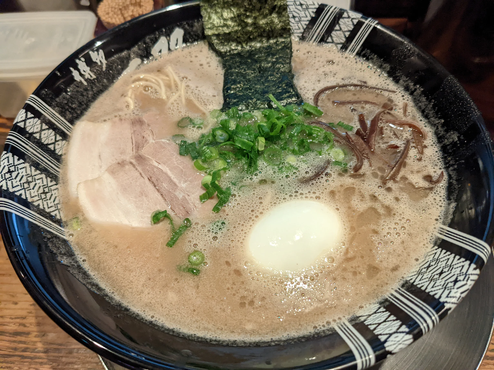
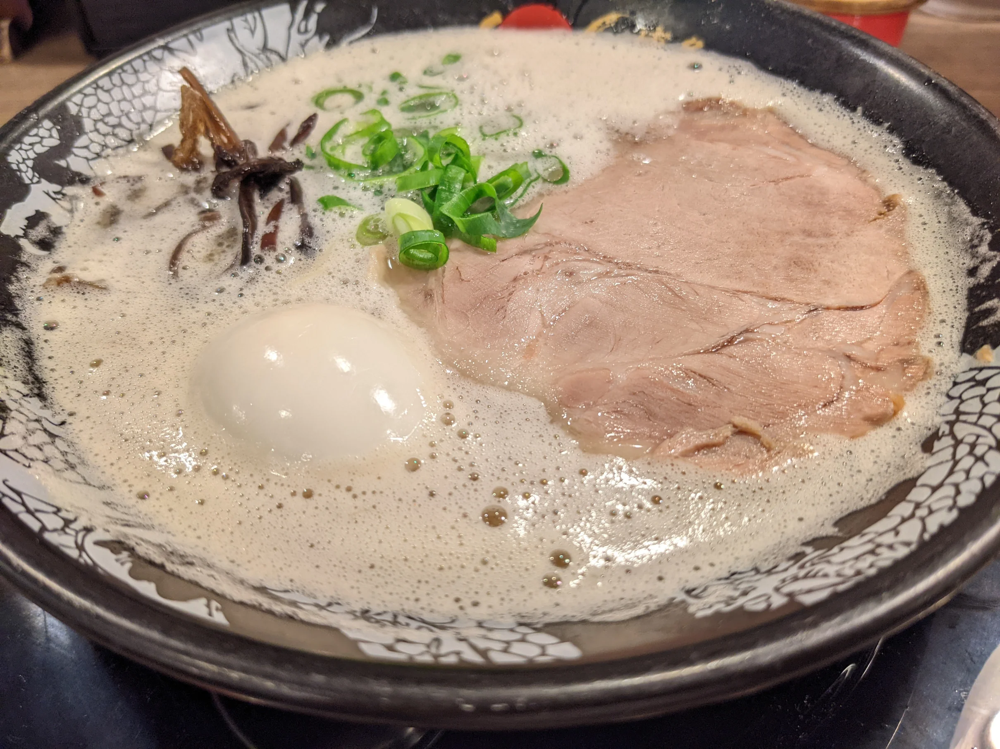
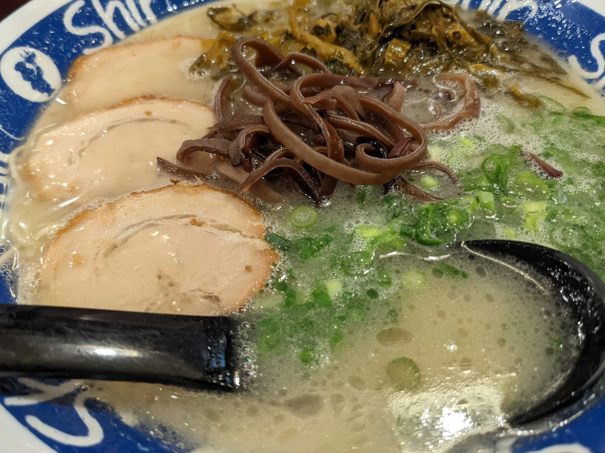
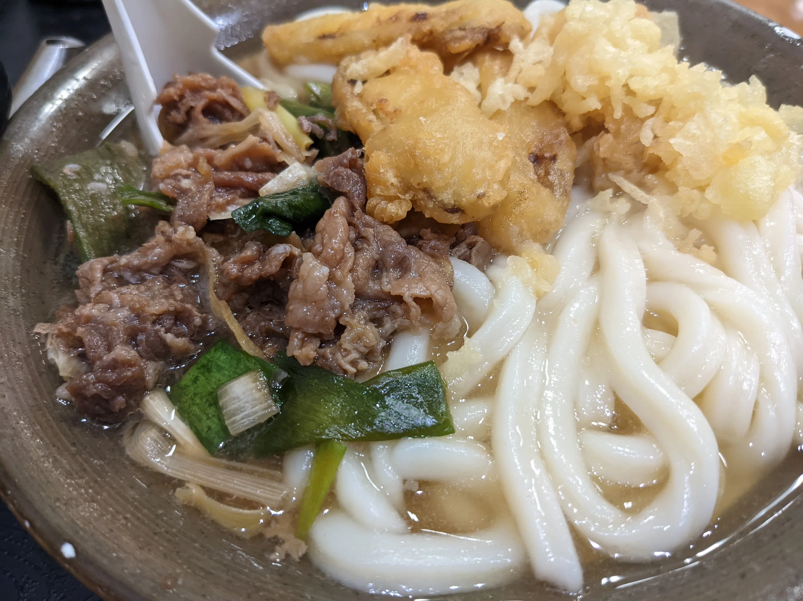
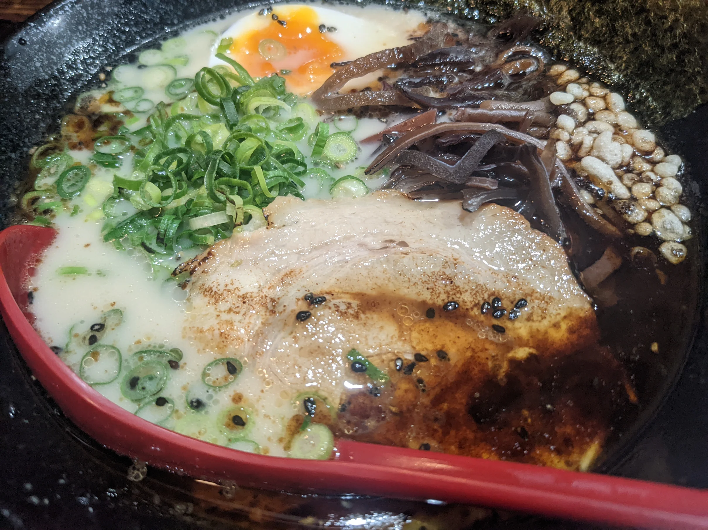
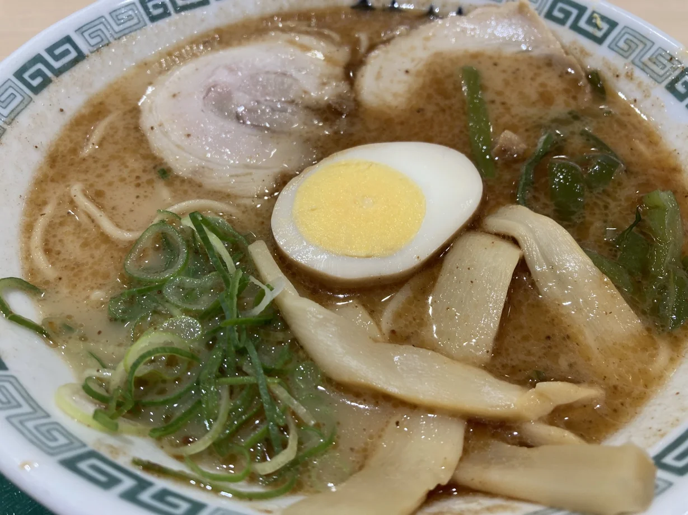

この記事は工学研究部新歓ブログリレー1日目の記事です。

[工研新歓ブログリレーの記事一覧](https://gotti.dev/post/koken_blog_relay_2022_index)

- 前の記事: なし
- 次の記事: [りんりんログ 工研新歓ブログリレー](https://lnln.dev/blog/2022/04/02/%E5%B7%A5%E7%A0%94%E6%96%B0%E6%AD%93%E3%83%96%E3%83%AD%E3%82%B0%E3%83%AA%E3%83%AC%E3%83%BC2022/#more)

はじめまして、20生のごっちです。工研では書類を出さない係をやっています。

新歓ブログリレーは[ミクライブをやっている謎サークルVLLがやってて](https://note.com/mikuec/m/m0b57ac309ecc)いいなと思ったので真似しています。レギュレーションはAnyで何書いてもいいようにしてます。たぶん。

さて、今は4/1の20時です。言い出しっぺなのにネタを考えてなくて泣いたので博多のラーメンの話をしてお茶を濁していきます。

一双 博多駅の東にあります。あっさりめで高菜を無限に乗せられる。

一幸舎 博多駅の構内にあります。あっさりめ。

shin-shin こってりめ、ニンニクを入れると罪の味。

牧のうどん 番外編。ごぼ天(ごぼうの天ぷら)うどんと一緒にかしわめしって東京じゃ食べないんですね。たしかに丸亀にはごぼ天もかしわめしも無いな。

一矢 中州(歌舞伎町みたいなとこ)にあり、朝4時まで営業してるので真夜中に行きました。マー油が入ってる熊本ラーメン、たぶんあっさりめ。高菜を無限に乗せられる。

桂花 これは熊本ラーメンです。麺が太くてマー油が入ってます。こってりめ。ここは焦がしニンニク置かれてませんでした。好きなだけ追加したい人生だった。。。

後ろ5軒は5日間で制覇しました、毎日ラーメン健康生活で胃が破壊されています。

みなさんも福岡に来たらラーメン食べ歩きいかがですか？
