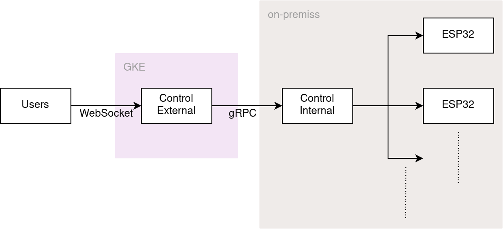

# はじめに

はじめまして。uec20のごっちです。工研では何もやらない人をやっています。これはUEC koken advent calendarの19日目の記事です。

今年はUEC1&2のアドカレに3つも記事を書いてしまったのですが、部長に脅されて記事を書けと言われたので書いています。4つめです。

[プラレールのインフラの話](https://gotti.dev/post/chofufes2021/)で話した通り、インフラはほとんどわたしがやっていました。学内側サーバのゲートウェイ周りは[あずきバーさん](https://twitter.com/azukibar_D)がtraefikでやってくれました。

バックエンドはわたしとあずきバーさんの二人でやっていました。

[リポジトリはこれです。](https://github.com/ueckoken/plarail2021-soft)

# 構成

これが今回の遠隔操作に関係するサーバです。

# 設計

バックエンドに関しては全て今回はフルスクラッチです。Go言語で書いています。

今回はユーザとサーバの間を常時WebSocketで繋いでおり双方向通信が可能です。前回は同期されていなかったユーザ間での信号やポイントの状態を同期するようにしています。

全ての状態はControl Externalが保持しています。これに対する変更がユーザから要求された場合は以下の順序で状態が更新されます。
- 衝突防止のためにその操作が適切であるか検証する。(あずきバーさんが書きました)
- 適切であればControl InternalにgRPCで操作を要求する。(あずきバー)
- 同時に接続されている全ユーザに変更の情報をブロードキャストする。

これと別に定期的に全ての信号の情報を全ユーザーにブロードキャストしています。これにより信号の情報が全ユーザー間で同期できています。

Control Internalはだいたいあずきバーさんが書いてくれたのでおまかせします。

あとクライアントの接続数などをprometheusのGoライブラリで吐いています。インフラの記事で説明してるやつですね。

ちなみにこの設計のままだとControl Internalに不適切なリクエストを投げればバグらせられます。gRPCには認証の機能がちゃんとあるのですが、切羽詰っていたのでVPNを使ってズルすることにしました。tailscaleというVPNソフトを使ってExternalとInternal間をsite-to-siteで接続しています。

当日動いた鯖の紹介は以上ですが、実はこの他に測位用の鯖やスピード制御用の鯖も書いていました。結局ハードからバックエンドとフロントまで全員が準備できることはなく爆破しましたが。。。

# 反省

モックを書くのをサボったり開発を一ヶ月前からしか開始しなかったりしてしまい、すみません。。。
