# 概要

はじめまして、ごっちです。
この記事は、散歩・徒歩・苦行 Advent Calendar 2023 の 7 日目の記事です。

前の記事は、もっちゃんの [実は不老不死！？気づいていないだけでやばいやつ？もっちゃんについて調べてみた（本当に苦行の人は記事を凝れない話）](https://mocchan.dev/daily-life/uec-sanpo-toho-kugyo-advent-calendar-2023/) です。

次の記事は、デギさんの[金欠でも大丈夫、苦行ドライブの始めかた2　～ＹＡＭＡＵＣＨＩの野望～](https://deguishomepage.vercel.app/%E8%8B%A6%E8%A1%8C/TapasTurismo.html) です。

## はじめに

ドライブをやりたいけど、お金がないときがあると思います。
記事を書くために再度苦行ドライブをやるつもりだったのですが、お金と時間が無く断念しました。だいたい卒論が悪い。
しょうがないのでこの記事では5月に実施した苦行ドライブを取り上げます。

## 片道GO

トヨタレンタカーが片道GOというサービスを実施しています。
片道GOは、誰かが高額なワンウェイ料金を払って乗り捨てた車を回送する代わりに、安く借りることができるサービスです。
この理由により、片道GOは車種、日時、出発/到着地などを自由に選ぶことができません。
借りられる車は、Webに公開されており、早いもの勝ちで借りることができます。

今回は48時間で一番良い保険を積んで、7700円でした。

### 予約

1. [トヨタレンタカーの片道GOサイト](https://cp.toyota.jp/rentacar/?padid=ag270_fr_sptop_onewayma) から良さげな車を探します。
2. 無ければ、現れるまで待ちます。
3. 見つかったら、載っている電話番号に電話して予約を取ります。

今回は東京→名古屋のプリウスを取ることができました。

### 予約後

予定の空いてるオタクを探し、連行します。
名古屋育ちのあずきバーさんが来てくれることになりました。適当に運転を交代しながら名古屋へ向かいます。

## 旅の始まり

10時、都内某所にて名古屋ナンバーのプリウスを借ります。
予約ページにはプリウスとしか書かれません。ガチャに成功し、新型でした。

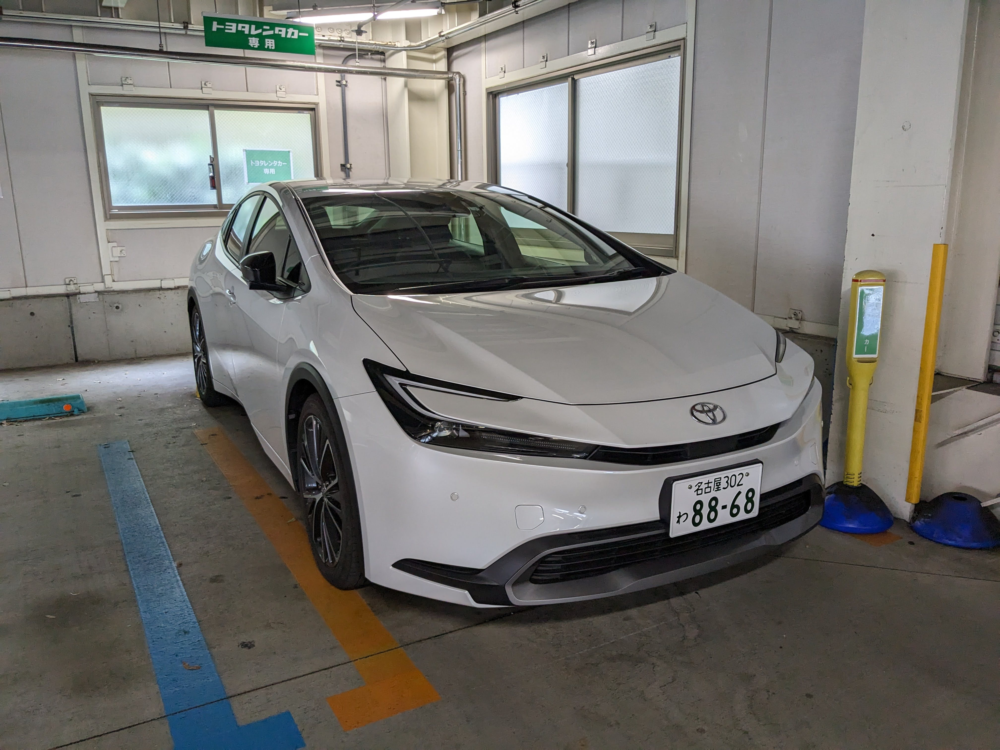

## 浜松まで

とりあえず浜松まで行きます。お金が無いので高速はなるべく使いません。。。
と思っていましたが、国道246号が渋滞していてツラかったのでさっそく高速に乗ります。

東名から富士山が見えます。

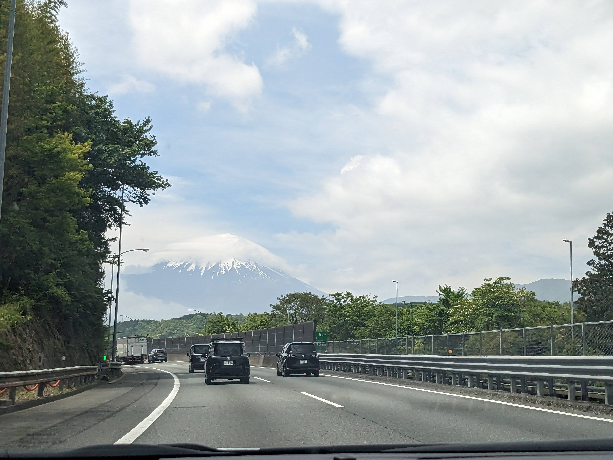

適当な所で高速を降り、国道1号でひたすら浜松に向かいます。

お昼ご飯は餃子になりました。

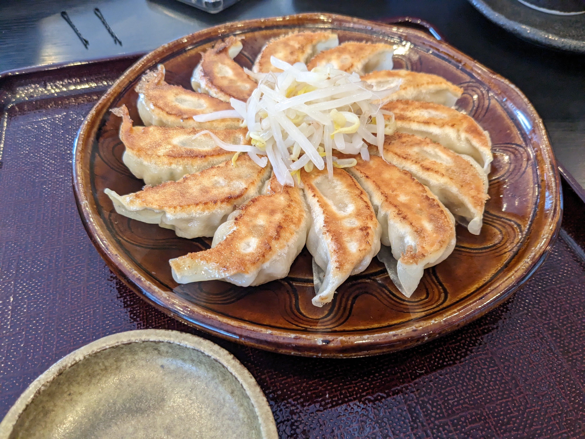

ご飯を食べて復活したので国道1号をひたすら走る……つもりがちょっと先で事故渋滞とGoogle Mapに言われ、しょうがないので一瞬だけ高速に課金しました。

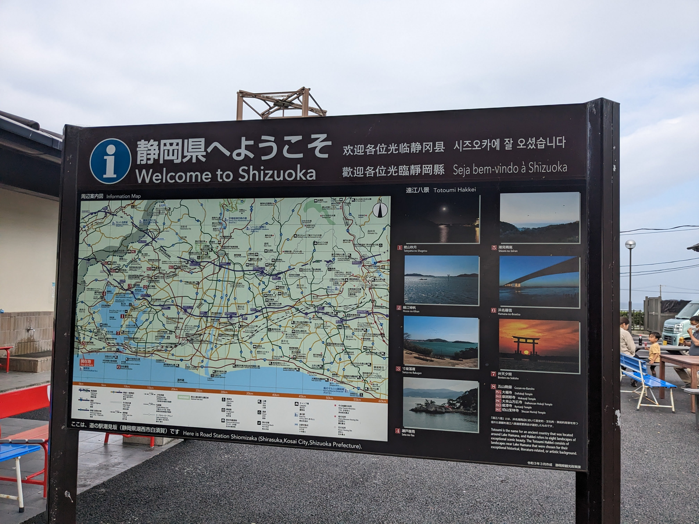

## 名古屋まで

現地ガイドのあずきバーさんが、[豊川には日本列島がある](https://maps.app.goo.gl/LRXT5mYsRHN9uSEm7)と言っているので、向かいます。

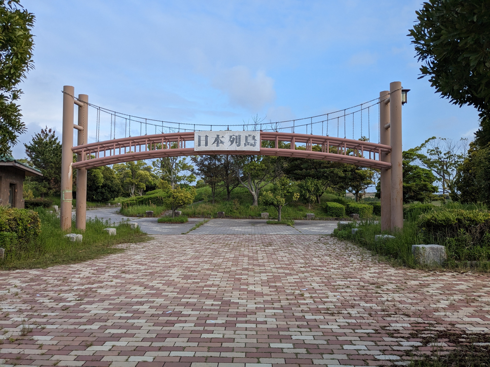

これしか写真撮ってないけど、中に割とデカい日本列島がありました。
豊川も観光したので、また国道1号に戻って名古屋へ向かいます。

道路がデカくなってきたり、高速が生えたりして名古屋っぽくなってきました。(写真なし)
せっかくなので、名古屋名物であるスプーンが変なラーメンを食べたいと現地ガイドに要望しました。

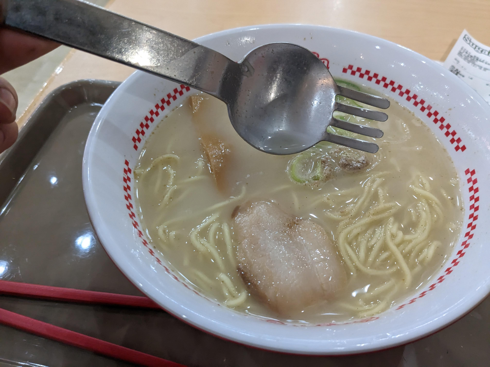

スプーンが変なラーメンを食べたところで、現地ガイドの実家を横目に、京都へ向かいます。
もう日が落ちてあたりは真っ暗ですが、国道1号をひたすら走り京都に到着しました。

## 京都

京都で淵野アタリを回収し、宿に到着しました。

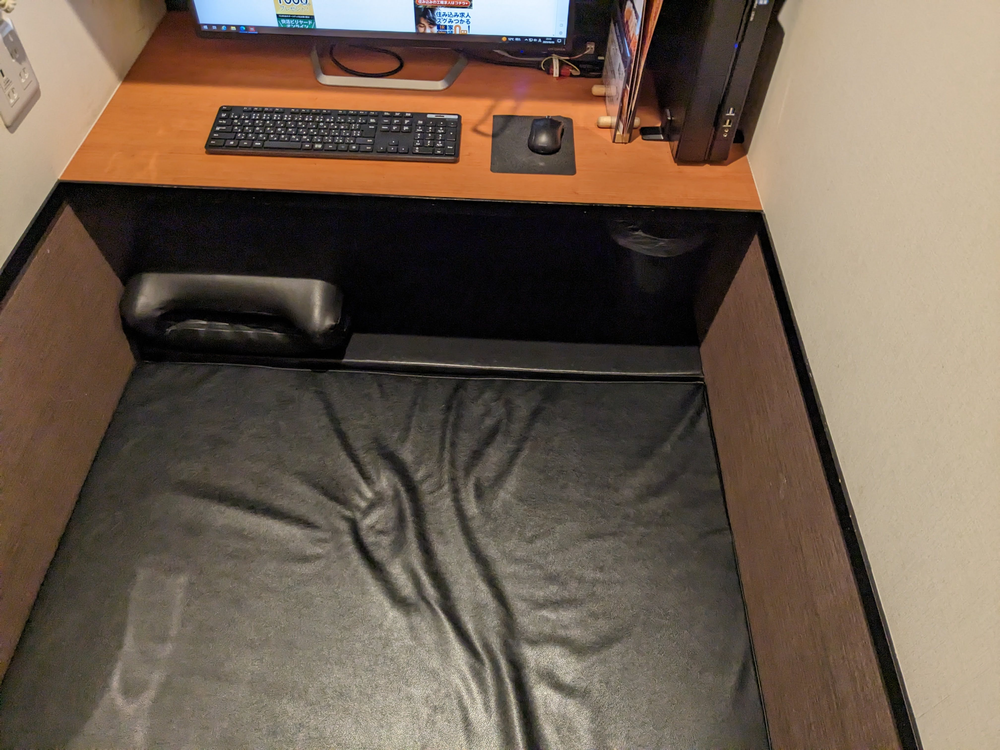

## 二日目

店長の誠意で、朝ご飯を頂きました。

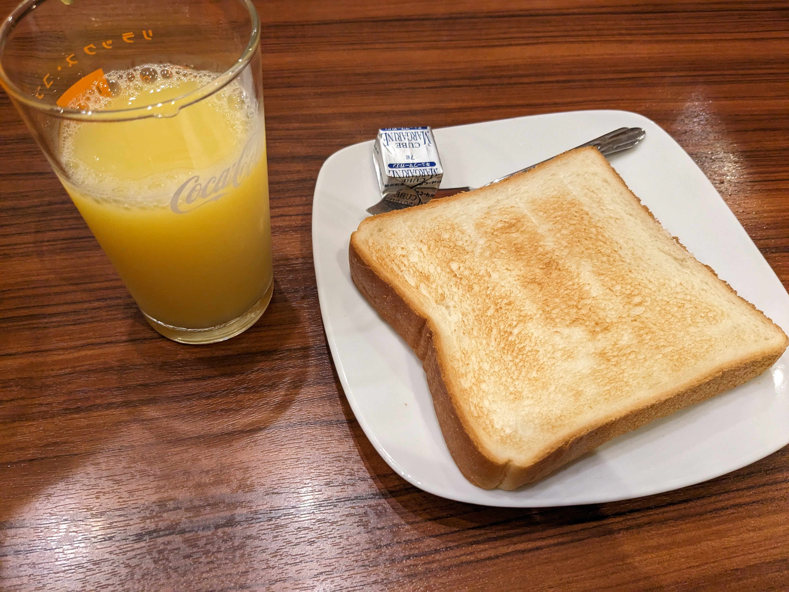

外の天気は最悪で、どしゃ降りです。
レンタルは今日までなので名古屋に戻ることにします。
道中で岐阜に寄って観光することにしました。

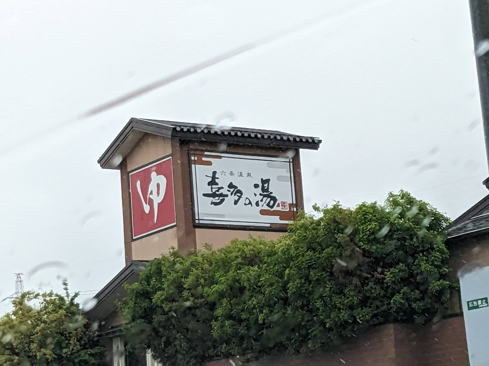

キターン

お昼ご飯は岐阜タンメンにしました。

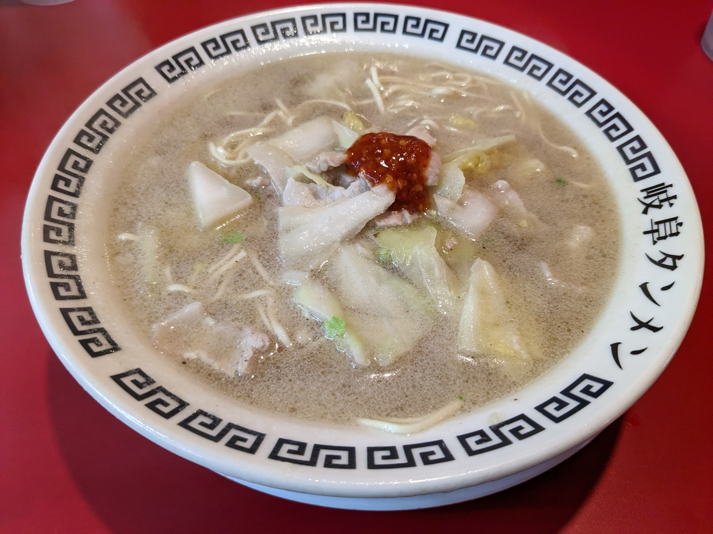

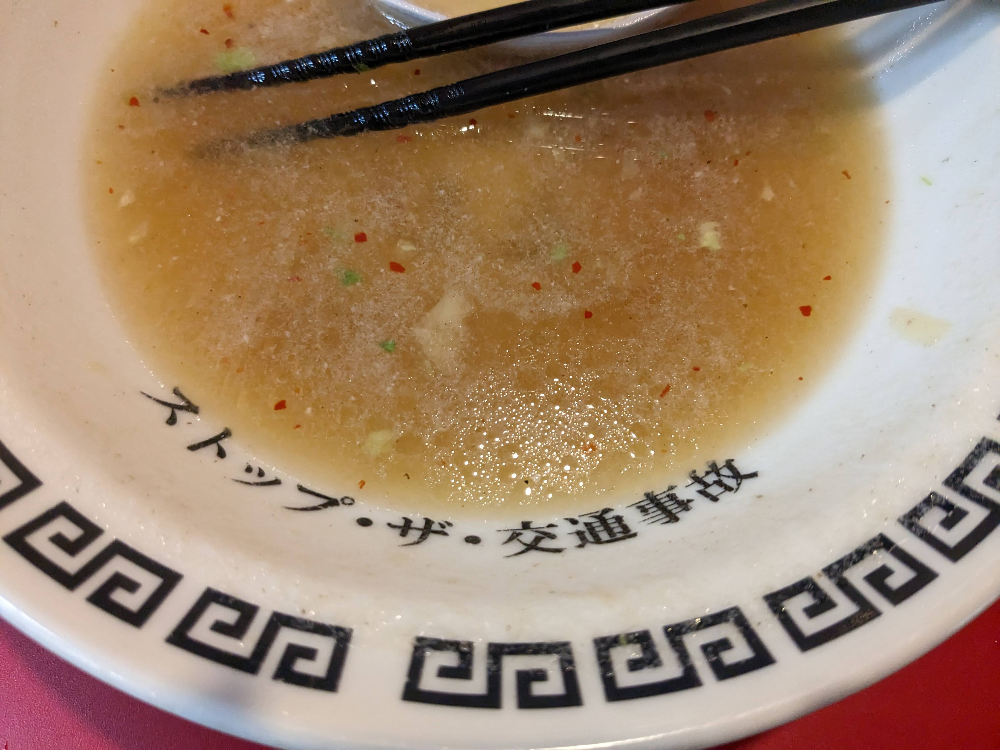

気をつけます。

名古屋を通過し、山道を越え、下呂温泉に到着しました。

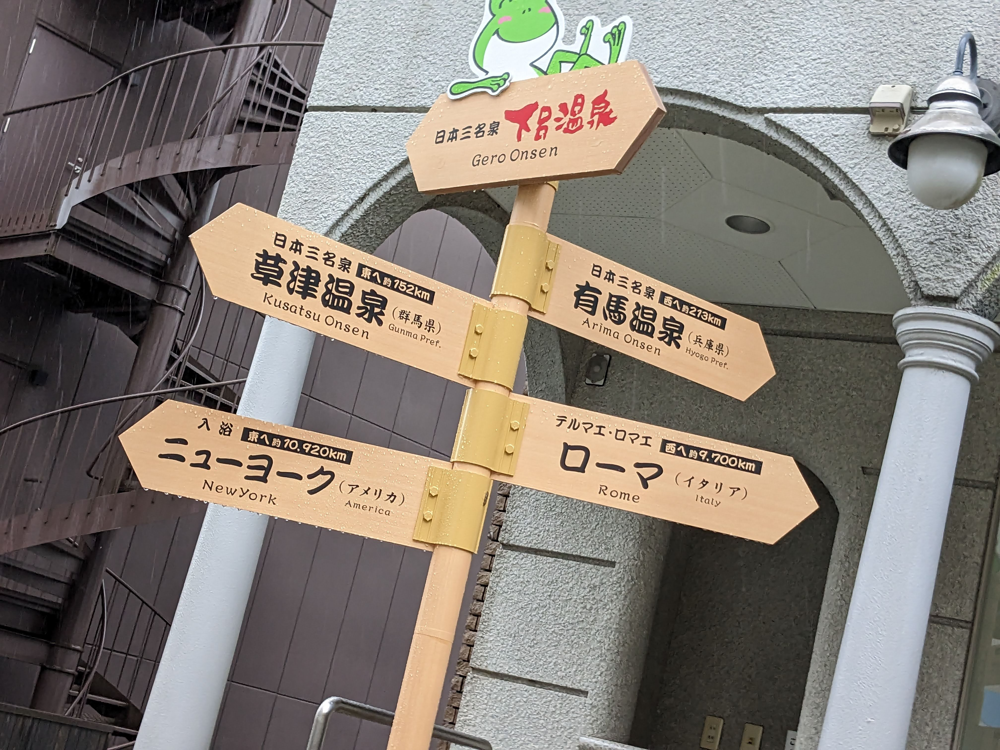

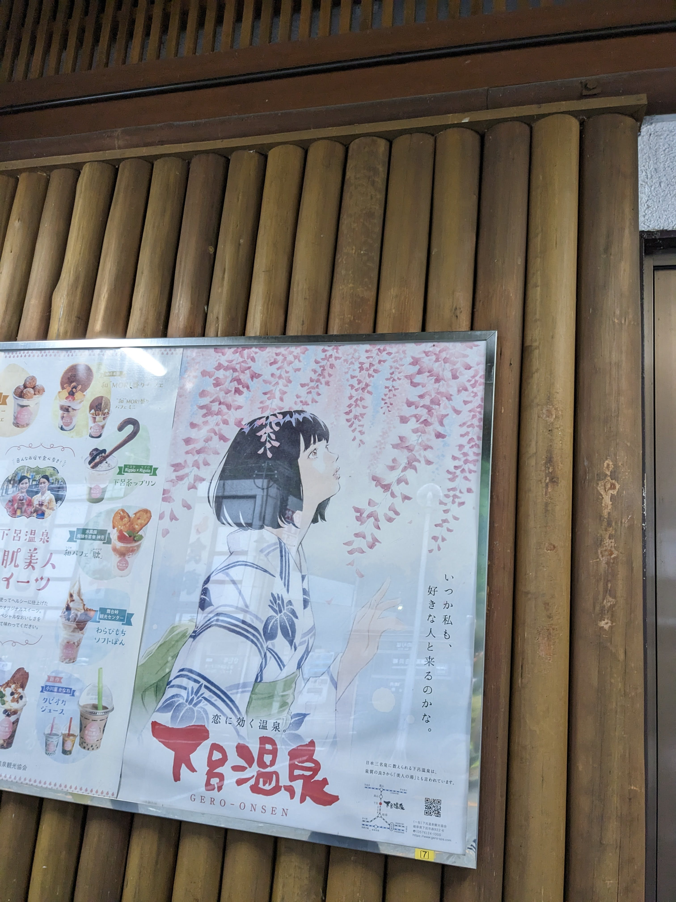

黒髪ボブ女がいて、HPが回復。

入浴し、また山道を走って名古屋へ帰ります。
ガソリンを入れて、レンタカーを返却しました。

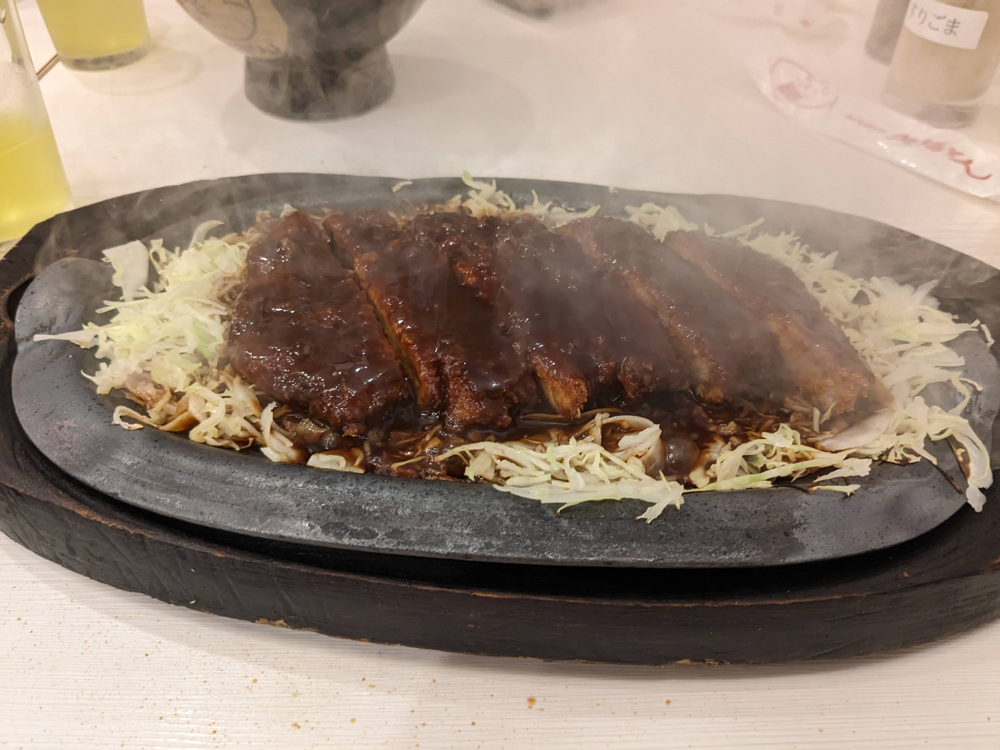

しんどいので帰りは新幹線で帰りました。

## リザルト

- 片道GO: 7,700円
- 高速代: 5,230円
- ガソリン代: 5,600円

合計: 18,530円
