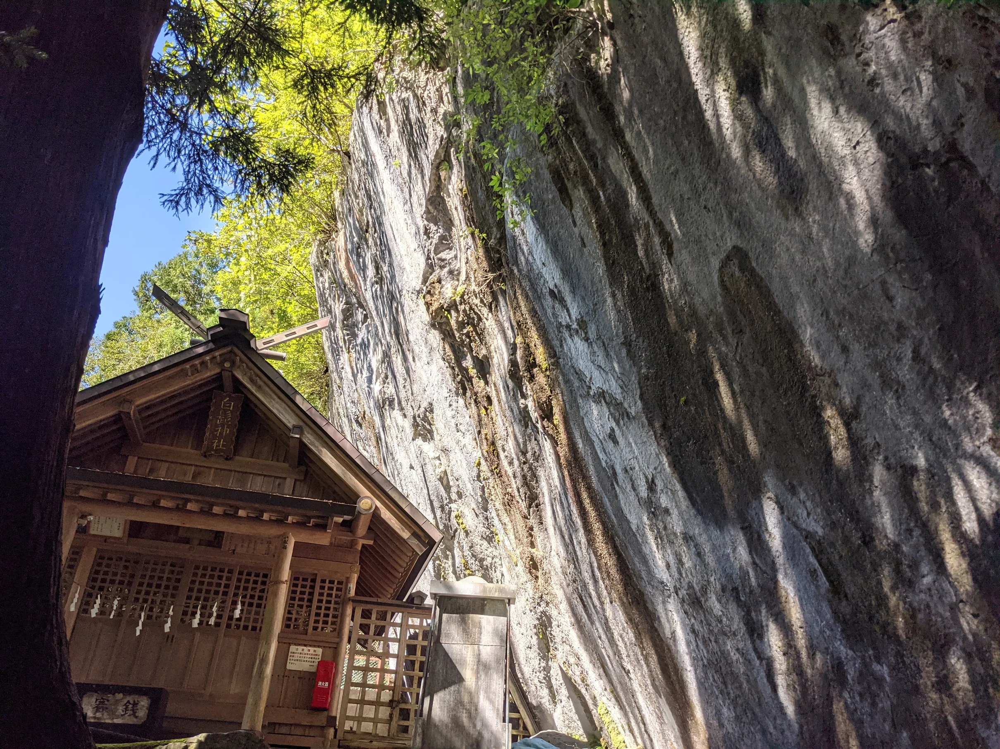

# 奥多摩おさんぽ概要

奥多摩、いいですよね。歴史と自然があります。

今回は小河内ダムから川井駅までの約13.4kmを歩きました。ただしこの距離を出したルートは車道で、わたしは山道など変な道を歩いたので若干違うと思います。

ほぼ始発で奥多摩駅へ向かい、奥多摩駅からバスで小河内ダムへ向かいました。登山客の方が多かったのですがわたしは歩くだけです。

# はじまり

人工降雨発煙所、何

良い天気ですね

奥多摩にはウォーキングルートがいくつかあります。そのうちの2つが奥多摩むかしみちと大多摩ウォーキングトレイルです。

奥多摩むかしみちは小河内ダム-奥多摩駅、大多摩ウォーキングトレイルは奥多摩駅-古里駅です。繋ってますね!うれしい!

このハイキングコースについての詳細はこのへんを参照してください。[https://www.okutama.gr.jp/site/walking/](https://www.okutama.gr.jp/site/walking/)

では小河内ダムから奥多摩むかし道を通って奥多摩駅へ向かいましょう。

こわい。

小河内湖

山道です。

小河内ダムが見えます。

このへんで(たぶん)旧道にでます。西久保の切り返しあたりですね。

吊り橋がありました!渡ってみましょう! 3人以上で渡っては駄目らしいです。

昔はここで馬を休めていたらしいです。

また吊り橋です。多いですね。

上にあるのは小河内ダムの建設用資材を運搬してた廃線らしいです。
下は普通に車道。

白髭神社。白いのは石灰岩の露頭です。

また廃線です。

この先は廃線のトンネル

むかしみち制覇です。

奥多摩駅の2階でお昼ご飯を食べます。

次に大多摩ウォーキングトレイルです。

梅沢大橋

白丸トンネル、右が旧道です。

あたたかみのあるトンネル

右が旧々道

旧々道に入るとこんなのがありました。

また道沿に進みます。今度は白丸ダムがあります。

魚道です。白丸ダムには魚が通れるように魚専用の通路が設けられており見学ができます。

どこかに魚影が見えます。どこかな？ここは

これが魚道です。

そと

ここを歩きます、怖すぎ。

ところで歩いていた道路の落石防止ネットにこんなのがありました。

これどうみてもNFCタグですよね？

ちなみに適当なリーダーアプリを入れたスマホを近づけるとucodeが表示されました。こういうucodeを探していく位置ゲー作ったら面白そうですよね。

もうちょっと進むと鳩ノ巣駅です。

ぽっぽというカフェがありました。豆乳チーズケーキとぶどうジュース(アルコールは入ってません)をいただきました。景色がすごい。

休憩もしたのでまた歩きます。といってもここから先はあまり面白みがないので写真がありませんでした。

奥多摩大橋に着いて徒歩終了です。

