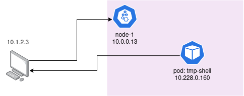

こんにちは、20のごっちです。この記事は[UEC 2 Advent Calendar 2022](https://adventar.org/calendars/7586)の14日目の記事です。

みなさん自宅鯖は飼っていますか？

## 背景

自宅鯖を初めてやった人はまず最初に家のルータの設定を弄り、DMZや静的NATなどよくわからん設定を弄り、DDNSの設定をし、サーバにグローバルIPを割り当てていると思います。プロバイダごとの差異のアレコレやグローバルIPがかわったり面倒ですよね。

ところでサーバが2台以上になったり実家と下宿に別々にサーバ置いて連携させたいとき、IPアドレスの管理が面倒になりますよね。実家と下宿の間でVPNを張ってルーティングやればええやんという声もあると思いますが、それをやるには業務用のルータが必要です。実家に置いてあるルータなんてメンテしてられません。そんな皆様に。。。

## 提案

[meshover](https://github.com/gotti/meshover) を開発しています。これをセットアップするだけで`10.1.2.3`のようなアドレスがパソコンにランダムに割り当てられ、オーバーレイネットワークに参加されます。他のサーバにも同じようにインストールすれば、そのIPアドレスを使ってパソコン同士で通信できます。パソコンを置いてる場所やルータの設定なんて関係ありません。

この機能だけ見てると[tailscale](https://tailscale.com/)でいいじゃん!ってなると思います。meshoverはtailscaleと違い自宅サーバクラスタに特化していてパソコンがBGPを喋ります。そのためパソコンだけでなく、そのパソコンの上で動いているVMやコンテナも1つのネットワークに接続されます。

自宅と実家の鯖の間でVM同士の通信ができるということは、つまり鯖がどこに置いてあるかを考えなくともその上のVMを触ることができるということです。

## 利点

- site-to-site VPNでよくある単一のEthernet(L2)ネットワークではなく単一のIP(L3)ネットワークを構築します。
  - 冗長性を柔軟に確保できたり管理しやすかったりします。
  - DHCPなどのイヤなL2プロトコルの影響を受けません。
- サーバに加えVMやコンテナまで同じネットワークにフラットに接続できます。
- L3ネットワークなので割り当てるIPはサブネットに縛られません。つまりグローバルIPとプライベートIPを1つのネットワークに混在できます。

## 要求

- グローバルIPv6アドレスが割り当てられていること。
  - 普通のNTT環境であればこれは満たされてます。
- グローバルIPを持ったコントローラを設置できること

## 手順

ここまでmeshoverについて利便性を推してきましたが使うのはある程度面倒です。トラシューにもある程度の知識が必要です。やりたい方は具体的な手順を載せてる[GitHubに上げたGetting Started](https://github.com/gotti/meshover/blob/main/docs/getting-started.md)を見てもらうとして、手順を簡単に説明します。

- meshoverコントローラを動かす。
  - 各パソコンで動いているエージェントのVPN公開鍵やIPアドレスなどを保存して全てのエージェントに共有します。
  - 自宅サーバのネットワークから独立させた方がいいかもしれません。私はGCPで動かしてます。
- meshoverエージェントをインストールする。
  - いくつか必要なツールがありますがバイナリを立ち上げるだけです。
  - ネットワークに参加させるパソコン全てで実施してください。

おわりです。簡単ですね(？)

こんな感じでdummy(loopback)デバイスが追加されます。

```
25: dummy-meshover0: <BROADCAST,NOARP,UP,LOWER_UP> mtu 1500 qdisc noqueue state UNKNOWN group default qlen 1000
    link/ether <macアドレス> brd ff:ff:ff:ff:ff:ff
    inet 10.1.2.3/32 scope global dummy-meshover0
       valid_lft forever preferred_lft forever
    inet6 fd00:dead:beef:9e0b::1/64 scope global 
       valid_lft forever preferred_lft forever
    inet6 fe80::aaaa:aaaa:aaaa:aaaa/64 scope link 
       valid_lft forever preferred_lft forever
```

トンネルはこんな感じのGREデバイスが追加されます。
```
49: meshover0-tun9@NONE: <POINTOPOINT,NOARP,UP,LOWER_UP> mtu 1396 qdisc noqueue state UNKNOWN group default qlen 1000
    link/gre 10.1.2.3 peer 10.2.3.4
    inet 10.1.2.4/32 scope global meshover0-tun9
       valid_lft forever preferred_lft forever
    inet6 fe80::aaaa:aaaa/64 scope link 
       valid_lft forever preferred_lft forever
```

ちなみに、ここまでしかやらないならtailscaleの方が対応OS多いしIPアドレスの要件が緩いしでtailscaleの方が良いです。

## 追加手順

VMやコンテナを動かしましょう。ところでVMやコンテナの管理に何を使っていますか？派閥はあると思いますがmeshoverはKubernetesとの連携を目的として開発したのでKubernetesを使いましょう。

### ところでKubernetesのコンテナってどう通信してるの

Kubernetes自身はほぼネットワークに関わらずCNI(Container Network Interface)に任せています。CNIにはいろいろな実装があり、CalicoとかFlannelとかCiliumが有名ではないでしょうか。CNIには次の最低限の2つの機能を持っているのがほとんどで、IPアドレスの割り当て、オーバーレイネットワーク構築などによるコンテナ間通信の確保です。さきほど挙げたCNIは全てBGPやVXLANを使って自身でオーバーレイネットワークを構築するなどの機能を持っています[^cni]。この機能についてはmeshoverが責任を持つためCNIには前者だけやってもらえばいいです。

### インストール

前者のIPアドレス管理だけをやるCNIとして[Cilium(Native Routingモード)](https://docs.cilium.io/en/stable/concepts/networking/routing/#id2)や[Coil](https://github.com/cybozu-go/coil)などがあります[^calico]。Ciliumにはおまけ機能が充実していたりと楽しいので私はCiliumを選択しました。

これも詳細な手順はmeshoverのgithubに上げているので雑に説明します。

- kubernetesをkubeadmなどでインストールします。
  - controlplane ipなどはmeshover側のipにすること
- ciliumのtunnelを切ったりmasqueradeの設定をやります。
- loadbalancerを入れます。
  - 私は[PureLB](https://purelb.gitlab.io/docs/)を入れました。

さて、さっそくコンテナを動かしてみましょう。meshoverはKubernetesを入れるパソコンと、実際にコマンドを叩くメイン機に導入しています。



このコンテナはKubernetesをインストールしたどのパソコンで動くのかわかりません。自宅で動いている可能性もありますし実家の可能性もあります。(指定はできますが)

以下のコマンドで`tmp-shell`から始まっているのはコンテナ内で実行したコマンドです。

CiliumのIPマスカレードにより一般の通信はパソコンの通常のプロバイダから出ます。私の自宅はフレッツのIIJ mio光なので、ちゃんと自宅の普通の経路を通っていますね。

```bash
$ kubectl run tmp-shell --rm -i --tty --image nicolaka/netshoot
tmp-shell  ~  ip a
149: eth0@if150: <BROADCAST,MULTICAST,UP,LOWER_UP> mtu 1500 qdisc noqueue state UP group default qlen 1000
    link/ether aa:aa:aa:aa:aa:aa brd ff:ff:ff:ff:ff:ff link-netnsid 0
    inet 10.228.0.160/32 scope global eth0
       valid_lft forever preferred_lft forever
    inet6 2403:bd80:c000:2fff::f0/128 scope global nodad 
       valid_lft forever preferred_lft forever
    inet6 fe80::e0b8:c5ff:fee7:bc91/64 scope link 
       valid_lft forever preferred_lft forever
tmp-shell  ~  tracepath 1.1.1.1
 1?: [LOCALHOST]                      pmtu 1500
 1:  no reply
 2:  10.228.0.13                                           0.233ms 
 3:  192.168.1.1                                           0.529ms 
 4:  192.168.1.1                                           0.354ms pmtu 1454
 4:  tokyo**-***.flets.2iij.net                           10.632ms
...
```

NativeRoutingCIDRに指定した`10.0.0.0/8`はオーバーレイネットワークを経由します。コンテナからメイン機へ通信してみましょう。数ホップで到達していますね。

```bash
tmp-shell  ~  tracepath 10.1.2.3
 1?: [LOCALHOST]                      pmtu 1500
 1:  no reply
 2:  10.228.0.13                                           0.103ms 
 3:  10.228.0.13                                           0.052ms pmtu 1476
 3:  10.228.0.13                                           0.068ms pmtu 1396
 3:  10.1.2.3                                              0.350ms reached
     Resume: pmtu 1396 hops 3 back 3 
```

こんな感じでKubernetesと連携しコンテナやVMのネットワークとIPアドレスを管理しやすくするmeshoverの紹介でした。

## あとがき

このツールは

- Kubernetesを使っていて
- サーバが複数あって
- 複数リージョンに分散していて
- VMやコンテナをガンガン使っている

方向けのツールです。それ以外の方は以下のツールが自宅鯖やるのに楽なのでオススメです。

- [Cloudflare Tunnel](https://developers.cloudflare.com/cloudflare-one/connections/connect-apps/)
  - 内側からcloudflareにトンネルを掘ってサーバを世界に公開します。ルータの設定がいりません、すごいぜ。
- [tailscale](https://tailscale.com/)
  - 散々例に出したツールです。パソコン間で自動でVPNを張って学校でも自宅鯖にアクセスできます。ぼくも愛用しています。

## 注釈

[^cni]: meshoverはKubernetesクラスタ外とも通信したりIPv6でVPNを張ったりするため、これらでは代替できません。
[^calico]: calicoにも似たような機能があるらしいんですが未調査です。
